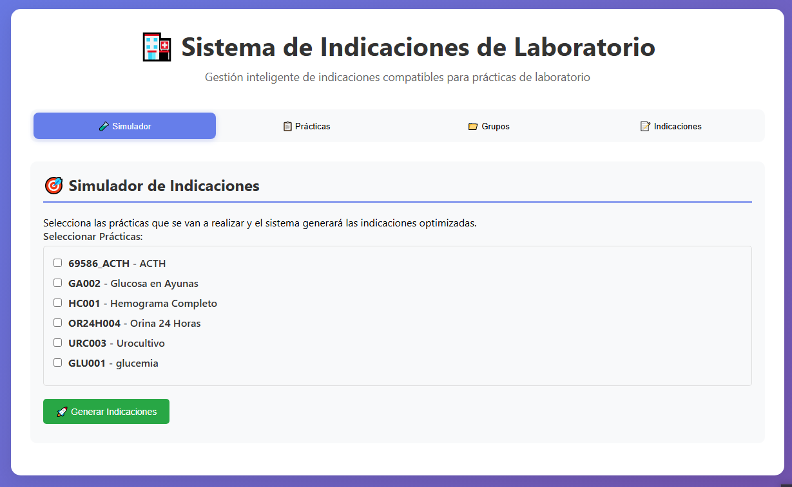

# 📸 INSTRUCCIONES PARA CAPTURAS DE PANTALLA

Para que el README se vea profesional, necesitas agregar capturas de pantalla de tu aplicación.

## 📁 Estructura de Carpetas

Crea una carpeta llamada `docs` en la raíz del proyecto:

```
indicaciones-app/
└── docs/
    ├── screenshot-home.png
    ├── screenshot-simulador.png
    ├── screenshot-practicas.png
    └── screenshot-cargador.png
```

## 📷 Cómo Tomar las Capturas

### 1. Screenshot Principal (screenshot-home.png)

1. Abre tu aplicación en: **http://localhost:3000**
2. Asegúrate de que se vea bien toda la pantalla principal
3. Presiona **Win + Shift + S** (Windows) o usa la **Herramienta Recortes**
4. Captura la ventana completa del navegador
5. Guarda como: `docs/screenshot-home.png`

**Qué debe mostrar:**
- El título principal
- Los 4 botones de navegación
- El contenido del simulador o la vista principal

### 2. Screenshot del Simulador (screenshot-simulador.png)

1. Haz clic en la pestaña **"Simulador"**
2. Selecciona 2-3 prácticas de ejemplo
3. Asegúrate de que se vean las prácticas seleccionadas
4. Captura la pantalla
5. Guarda como: `docs/screenshot-simulador.png`

**Qué debe mostrar:**
- Lista de prácticas con checkboxes
- Algunas prácticas seleccionadas (marcadas)
- El botón "Generar Indicaciones"

### 3. Screenshot de Prácticas (screenshot-practicas.png)

1. Haz clic en la pestaña **"Prácticas"**
2. Asegúrate de que se vea la lista de prácticas
3. Captura la pantalla
4. Guarda como: `docs/screenshot-practicas.png`

**Qué debe mostrar:**
- Tabla o lista de prácticas
- Códigos y nombres de prácticas
- Botones de acción si los hay

### 4. Screenshot del Cargador (screenshot-cargador.png)

1. Ve a: **http://localhost:3000/cargador**
2. Asegúrate de que se vea la interfaz del cargador
3. Captura la pantalla
4. Guarda como: `docs/screenshot-cargador.png`

**Qué debe mostrar:**
- El botón para seleccionar archivo Excel
- Instrucciones de carga
- La interfaz completa del cargador

## 🎨 Consejos para Buenas Capturas

### Preparación del Navegador

1. **Zoom**: Asegúrate de que el zoom esté al 100% (Ctrl + 0)
2. **Ventana**: Maximiza la ventana del navegador
3. **Limpieza**: Cierra tabs innecesarias
4. **Modo**: Usa modo normal (no modo oscuro del navegador)

### Durante la Captura

- ✅ Captura toda la aplicación visible
- ✅ Asegúrate de que el texto sea legible
- ✅ Evita capturar tu barra de tareas o información personal
- ✅ Si capturas con datos, usa datos de ejemplo

### Formato de las Imágenes

- **Formato**: PNG (mejor calidad)
- **Resolución**: Al menos 1280x720 px
- **Tamaño**: Máximo 2-3 MB por imagen
- **Nombre**: Exactamente como se indica arriba

## 🖼️ Herramientas Recomendadas

### Windows
- **Recortes** (Win + Shift + S) - Incluido en Windows
- **Snipping Tool** - Herramienta de Windows
- **ShareX** - Gratuito, muy completo

### Edición (opcional)
- **Paint** - Para recortar o agregar flechas
- **Paint.NET** - Gratuito, más funciones
- **GIMP** - Gratuito, profesional

## ✂️ Cómo Recortar/Editar

Si las capturas quedan muy grandes:

1. Abre la imagen en Paint o Paint.NET
2. Selecciona la herramienta **Recortar**
3. Ajusta para mostrar solo lo importante
4. Guarda como PNG

Si quieres añadir anotaciones:

1. Usa la herramienta de **texto** o **flecha**
2. Marca características importantes
3. Usa colores que contrasten (rojo, amarillo)

## 📦 Después de Tomar las Capturas

1. Verifica que todas estén en la carpeta `docs/`
2. Verifica que los nombres sean exactos:
   - `screenshot-home.png`
   - `screenshot-simulador.png`
   - `screenshot-practicas.png`
   - `screenshot-cargador.png`

3. Agrega las imágenes a Git:
   ```bash
   git add docs/
   git commit -m "Agregar capturas de pantalla al README"
   ```

## 🚫 Qué NO Incluir en las Capturas

- ❌ Información personal (emails, nombres reales)
- ❌ URLs de desarrollo locales sensibles
- ❌ Contraseñas o tokens
- ❌ Datos médicos reales de pacientes
- ❌ Barra de tareas con información privada

## ✅ Checklist Final

Antes de subir a GitHub, verifica:

- [ ] Carpeta `docs/` creada
- [ ] 4 capturas de pantalla tomadas
- [ ] Nombres de archivos correctos
- [ ] Imágenes en formato PNG
- [ ] Calidad legible (texto claro)
- [ ] Sin información sensible
- [ ] Agregadas a Git

---

## 🆘 Si No Puedes Tomar las Capturas

Si por algún motivo no puedes tomar las capturas ahora:

1. **Elimina las referencias** a las imágenes en el README:
   - Borra las líneas que dicen ``

2. O **comenta** las imágenes:
   ```markdown
   <!--  -->
   ```

3. Súbelo sin imágenes y agrégalas más tarde con:
   ```bash
   git add docs/
   git commit -m "Agregar capturas de pantalla"
   git push
   ```

---

**¡Listo!** Una vez tengas las capturas, tu README se verá profesional y completo. 🎉
