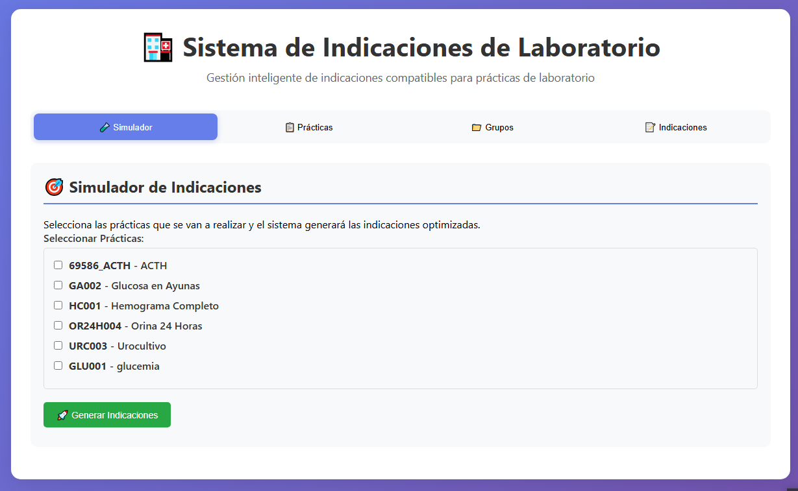
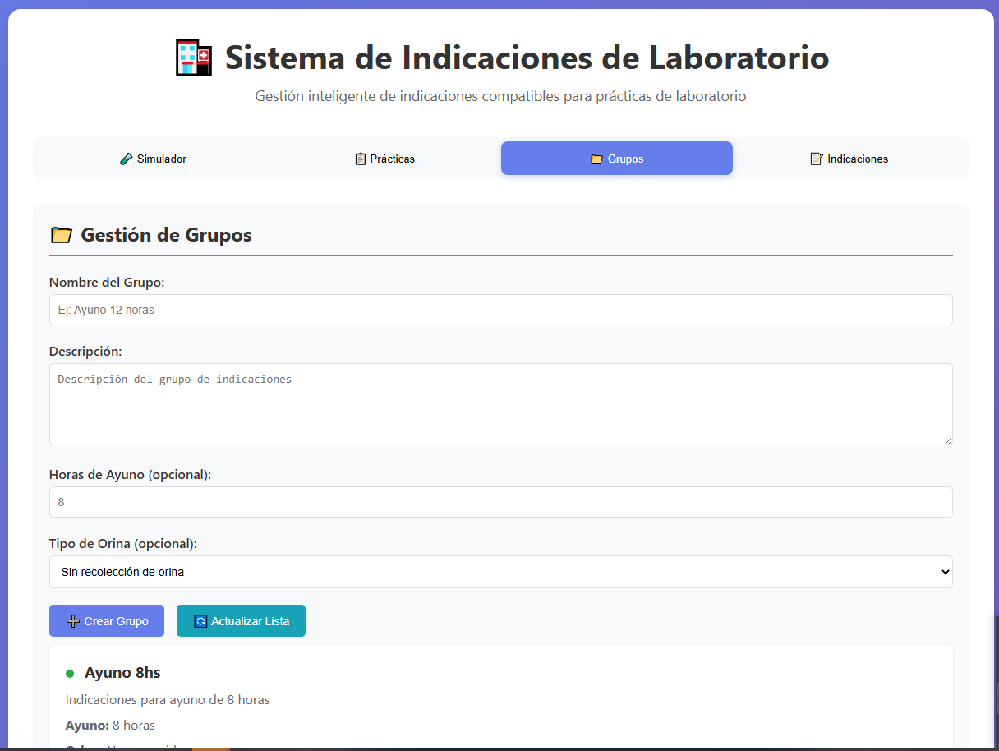
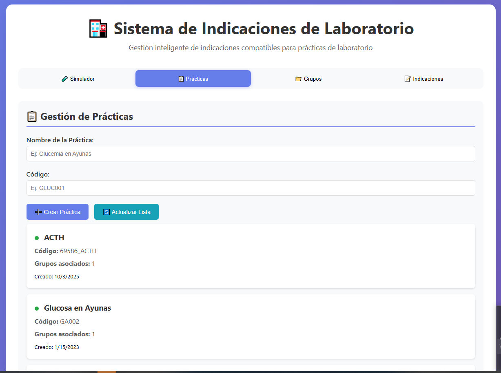
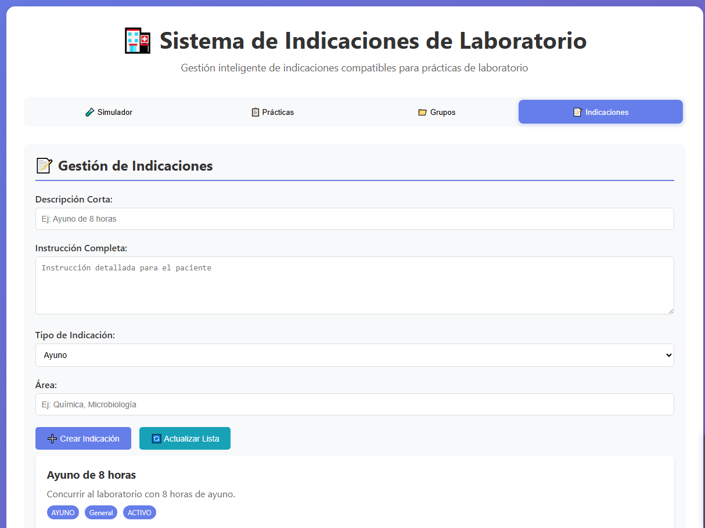
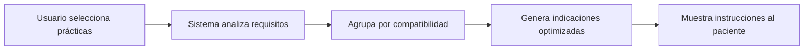

# 🧪 Sistema de Indicaciones de Laboratorio



Sistema inteligente de gestión de indicaciones para prácticas de laboratorio con detección automática de compatibilidades y optimización de preparación del paciente.

---

## 📸 Capturas de Pantalla

### Simulador de Indicaciones


*Interfaz principal donde se seleccionan las prácticas y se generan las indicaciones optimizadas*

### Gestión de Prácticas


*Catálogo completo de prácticas de laboratorio organizadas por código y nombre*

### Cargador de Datos


*Herramienta para importar masivamente prácticas desde archivos Excel*

---

## 🎯 Características Principales

- ✅ **Gestión de Prácticas**: Catálogo completo de 264+ prácticas de laboratorio
- 📋 **Grupos de Compatibilidad**: Agrupación automática por requisitos similares
- 📝 **Indicaciones Optimizadas**: Generación inteligente de instrucciones para pacientes
- 🔄 **Compatibilidad Automática**: Detección de prácticas que pueden realizarse juntas
- 📊 **Importación de Datos**: Carga masiva desde archivos Excel
- 🎨 **Interfaz Amigable**: Sistema web moderno y responsive
- 🧬 **Grupos Alternativos**: Manejo de casos especiales con reglas de compatibilidad

---

## 🏗️ Arquitectura del Sistema

### Flujo de Trabajo



### Grupos de Compatibilidad

El sistema organiza las prácticas en grupos según:

1. **Requisitos de Ayuno**: 
   - Sin ayuno
   - 3 horas
   - 4 horas
   - 8 horas
   - 12 horas

2. **Recolección de Orina**: 
   - Primera orina de la mañana
   - Orina de 2 horas
   - Orina de 12 horas
   - Orina de 24 horas

3. **Tipo de Muestra**: 
   - Sangre
   - Orina
   - Materia fecal
   - Saliva
   - Otros fluidos

4. **Área de Laboratorio**: 
   - Química
   - Bacteriología
   - Virología
   - Endocrinología
   - Hematología/Hemostasia
   - Inmunología

### Modelo de Base de Datos

```
┌─────────────┐
│  PRACTICA   │
└──────┬──────┘
       │
       ├──────> ┌──────────────────┐      ┌────────┐
       │        │ PRACTICA_GRUPO   │─────>│ GRUPO  │
       │        └──────────────────┘      └───┬────┘
       │                                       │
       │        ┌──────────────────┐      ┌───▼────────┐
       │        │ GRUPO_INDICACION │─────>│ INDICACION │
       │        └──────────────────┘      └────────────┘
       │
       └──────> ┌──────────────────────┐
                │ GRUPOS_ALTERNATIVOS  │
                └──────────────────────┘
```

---

## 🚀 Instalación

### Requisitos Previos

- **Node.js** 18 o superior
- **npm** o **yarn**
- **Git**

### Instalación Paso a Paso

```bash
# 1. Clonar el repositorio
git clone https://github.com/TU_USUARIO/indicaciones-laboratorio.git
cd indicaciones-laboratorio

# 2. Instalar dependencias
npm install

# 3. Generar cliente de Prisma
npm run db:generate

# 4. (Opcional) Ejecutar migraciones
npm run db:migrate

# 5. Iniciar el servidor
npm start
```

El sistema estará disponible en: **http://localhost:3000**

---

## 📦 Scripts Disponibles

| Script | Descripción |
|--------|-------------|
| `npm start` | Inicia el servidor en modo producción |
| `npm run dev` | Inicia el servidor con hot-reload |
| `npm run db:migrate` | Ejecuta migraciones de base de datos |
| `npm run db:generate` | Genera el cliente de Prisma |
| `npm run db:studio` | Abre Prisma Studio (GUI para la BD) |
| `npm run db:seed` | Carga datos de ejemplo |

---

## 🔧 Configuración

### Variables de Entorno

Crea un archivo `.env` en la raíz del proyecto:

```env
PORT=3000
NODE_ENV=development
DATABASE_URL="file:./prisma/indicaciones.db"
```

### Estructura de Datos Excel

Para importar prácticas desde Excel, el archivo debe tener las siguientes columnas:

| Columna | Descripción | Ejemplo |
|---------|-------------|---------|
| `codigo` | Código único de la práctica | `69586` |
| `nombre` | Nombre descriptivo | `ACTH` |
| `area` | Área del laboratorio | `ENDOCRINO` |
| `ayuno_horas` | Horas de ayuno requeridas | `8` |
| `orina_tipo` | Tipo de recolección | `ORINA_24H` |

---

## 📊 Uso del Sistema

### 1. Cargar Datos desde Excel

1. Accede a **http://localhost:3000/cargador**
2. Haz clic en **"Seleccionar archivo Excel"**
3. Selecciona tu archivo con las prácticas
4. Haz clic en **"Cargar Datos"**
5. El sistema procesará y creará automáticamente:
   - ✅ Prácticas
   - ✅ Grupos de compatibilidad
   - ✅ Indicaciones por grupo
   - ✅ Relaciones entre prácticas y grupos

### 2. Generar Indicaciones para un Paciente

1. Accede a **http://localhost:3000**
2. En el **Simulador**, selecciona las prácticas que necesita el paciente
3. Haz clic en **"Generar Indicaciones"**
4. El sistema mostrará:
   - ✅ Indicaciones optimizadas (sin redundancias)
   - ✅ Requisitos de ayuno consolidados
   - ✅ Instrucciones de recolección de muestras
   - ✅ Grupos utilizados para la generación

### 3. Gestionar Prácticas

1. Ve a la pestaña **"Prácticas"**
2. Puedes:
   - Ver todas las prácticas disponibles
   - Buscar por código o nombre
   - Ver detalles de cada práctica
   - Editar información (requiere permisos)

### 4. Ver Grupos y Configuración

1. Ve a la pestaña **"Grupos"**
2. Explora los grupos de compatibilidad
3. Revisa qué prácticas pertenecen a cada grupo

---

## 🗂️ Estructura del Proyecto

```
indicaciones-app/
├── docs/                      # Documentación y capturas
│   ├── screenshot-home.png
│   ├── screenshot-simulador.png
│   └── screenshot-cargador.png
├── prisma/
│   ├── schema.prisma          # Esquema de base de datos
│   ├── migrations/            # Historial de migraciones
│   └── indicaciones.db        # Base de datos SQLite
├── src/
│   ├── database/
│   │   └── prisma.js          # Cliente Prisma
│   ├── routes/
│   │   ├── practicas.js       # API de prácticas
│   │   ├── grupos.js          # API de grupos
│   │   └── indicaciones.js    # API de indicaciones
│   └── server.js              # Servidor Express
├── public/
│   ├── index.html             # Interfaz principal
│   ├── cargador.html          # Cargador de datos
│   └── styles.css             # Estilos
├── datos_reales_import.sql    # Datos de ejemplo
├── .gitignore                 # Archivos ignorados por Git
├── package.json               # Dependencias del proyecto
└── README.md                  # Este archivo
```

---

## 🛠️ Stack Tecnológico

### Backend
- **Node.js** v18+
- **Express.js** v4.18 - Framework web
- **Prisma ORM** v5.7 - ORM moderno para Node.js
- **SQLite** - Base de datos embebida

### Frontend
- **HTML5** + **CSS3** + **JavaScript Vanilla**
- **Responsive Design** - Compatible con todos los dispositivos

### Librerías
- **xlsx** v0.18 - Procesamiento de archivos Excel
- **cors** - Manejo de CORS
- **helmet** - Seguridad HTTP
- **morgan** - Logger de requests

---

## 📋 API Endpoints

### Prácticas

```http
GET    /api/practicas           # Listar todas las prácticas
GET    /api/practicas/:id       # Obtener práctica específica
POST   /api/practicas           # Crear nueva práctica
PUT    /api/practicas/:id       # Actualizar práctica
DELETE /api/practicas/:id       # Eliminar práctica
```

### Grupos

```http
GET    /api/grupos              # Listar todos los grupos
GET    /api/grupos/:id          # Obtener grupo con sus prácticas e indicaciones
POST   /api/grupos              # Crear nuevo grupo
PUT    /api/grupos/:id          # Actualizar grupo
DELETE /api/grupos/:id          # Eliminar grupo
```

### Indicaciones

```http
GET    /api/indicaciones                # Listar todas las indicaciones
GET    /api/indicaciones/:id            # Obtener indicación específica
POST   /api/indicaciones/generar        # Generar indicaciones optimizadas
```

**Ejemplo de request para generar indicaciones:**

```javascript
POST /api/indicaciones/generar
Content-Type: application/json

{
  "practicasIds": [69586, 69613, 69424]
}
```

**Respuesta:**

```json
{
  "success": true,
  "data": {
    "indicacionesOptimizadas": "INDICACIONES PARA EL PACIENTE:\n\n1. Ayuno de 8 horas...",
    "gruposUtilizados": [
      {
        "id_grupo": 7,
        "nombre": "ENDOCRINO_AYUNO8H",
        "ayuno_horas": 8,
        "practicas_count": 2
      }
    ],
    "detalles": {
      "totalPracticas": 3,
      "totalGrupos": 2,
      "ayunoMaximo": 8,
      "requiereOrina": true
    }
  }
}
```

### Sistema

```http
GET    /api/health              # Estado del sistema
GET    /api/debug/count         # Contadores de registros en BD
```

---

## 🧪 Casos de Uso

### Ejemplo 1: Paciente con estudios endocrinos

**Prácticas solicitadas:**
- ACTH (69586)
- Insulina (69613)
- Cortisol (70274)

**Resultado:**
El sistema detecta que todas requieren:
- ✅ Ayuno de 8 horas
- ✅ Extracción entre 7:00 y 8:30 AM
- ✅ Evitar estrés antes de la extracción

**Indicaciones generadas:**
```
PREPARACIÓN PARA SUS ESTUDIOS:

1. Ayuno de 8 horas antes del estudio
2. Concurrir al laboratorio entre las 7:00 y 8:30 hs
3. Evitar situaciones de estrés antes de la extracción
4. No realizar actividad física intensa
5. Informar toda medicación al extraccionista
```

### Ejemplo 2: Estudios de orina

**Prácticas solicitadas:**
- Urocultivo (69455)
- Orina completa (69424)
- Calcio en orina 24hs (69254)

**Resultado:**
El sistema optimiza las indicaciones:
- ✅ Agrupa las dos primeras (primera orina)
- ✅ Separa la recolección de 24 horas
- ✅ Evita redundancias en las instrucciones

---

## 🤝 Contribuir

¡Las contribuciones son bienvenidas! Para contribuir:

1. **Fork** el proyecto
2. Crea una **rama** para tu feature:
   ```bash
   git checkout -b feature/MiNuevaCaracteristica
   ```
3. **Commit** tus cambios:
   ```bash
   git commit -m 'Agregar nueva característica increíble'
   ```
4. **Push** a la rama:
   ```bash
   git push origin feature/MiNuevaCaracteristica
   ```
5. Abre un **Pull Request**

### Guía de Estilo

- Usa nombres descriptivos para variables y funciones
- Comenta código complejo
- Sigue las convenciones de ES6+
- Escribe mensajes de commit claros

---

## 🐛 Reportar Issues

Si encuentras un bug o tienes una sugerencia:

1. Ve a la sección de [Issues](https://github.com/TU_USUARIO/indicaciones-laboratorio/issues)
2. Busca si ya existe un issue similar
3. Si no existe, crea uno nuevo con:
   - 📝 Descripción clara del problema
   - 🔄 Pasos para reproducirlo
   - 💻 Información del entorno (SO, versión de Node, etc.)
   - 📸 Capturas de pantalla si es posible

---

## 📝 Licencia

Este proyecto está bajo la **Licencia MIT**. Ver archivo [LICENSE](LICENSE) para más detalles.

```
MIT License

Copyright (c) 2025 DGSISAN

Permission is hereby granted, free of charge, to any person obtaining a copy
of this software and associated documentation files (the "Software")...
```

---

## 👥 Autores

- **Equipo DGSISAN** - *Desarrollo y diseño* - 2025
- **RED de Laboratorios** - *Provisión de datos y requisitos*

---

## 🙏 Agradecimientos

- 🏥 **RED de Laboratorios** por proporcionar los datos de prácticas e indicaciones
- 💻 **Comunidad Open Source** por las herramientas utilizadas
- 👨‍⚕️ **Profesionales de laboratorio** por la validación de las indicaciones
- 🎨 **Diseñadores** que inspiraron la interfaz

---

## 📞 Soporte y Contacto

¿Necesitas ayuda? Tienes varias opciones:

- 📧 **Email**: soporte@dgsisan.gob.ar
- 🐛 **Issues**: [GitHub Issues](https://github.com/TU_USUARIO/indicaciones-laboratorio/issues)
- 📖 **Documentación**: [Wiki del proyecto](https://github.com/TU_USUARIO/indicaciones-laboratorio/wiki)
- 💬 **Discusiones**: [GitHub Discussions](https://github.com/TU_USUARIO/indicaciones-laboratorio/discussions)

---

## 🗺️ Roadmap

### v1.0 (Actual)
- ✅ Sistema básico de gestión de prácticas
- ✅ Generación de indicaciones optimizadas
- ✅ Importación desde Excel
- ✅ Interfaz web responsive

### v1.1 (Próximo)
- 🔄 Sistema de usuarios y permisos
- 🔄 Historial de indicaciones generadas
- 🔄 Exportación de indicaciones a PDF
- 🔄 API REST completa con autenticación

### v2.0 (Futuro)
- ⏳ Integración con sistemas hospitalarios
- ⏳ App móvil (iOS/Android)
- ⏳ Notificaciones automáticas a pacientes
- ⏳ Dashboard de estadísticas y reportes

---

## 📊 Estadísticas del Proyecto


---

<div align="center">

### ⭐ Si este proyecto te resulta útil, considera darle una estrella en GitHub

**Hecho con ❤️ por el equipo DGSISAN**

[⬆️ Volver arriba](#-sistema-de-indicaciones-de-laboratorio)

</div>
