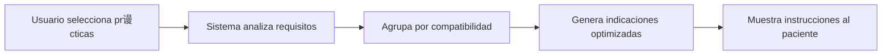

# ��И Sistema de Indicaciones de Laboratorio


Sistema inteligente de gesti贸n de indicaciones para pr谩cticas de laboratorio con detecci贸n autom谩tica de compatibilidades y optimizaci贸n de preparaci贸n del paciente.

---

## ���� Capturas de Pantalla

### Simulador de Indicaciones


*Interfaz principal donde se seleccionan las pr谩cticas y se generan las indicaciones optimizadas*

### Gesti贸n de Pr谩cticas


*Cat谩logo completo de pr谩cticas de laboratorio organizadas por c贸digo y nombre*

### Cargador de Datos


*Herramienta para importar masivamente pr谩cticas desde archivos Excel*

---

## ���� Caracter铆sticas Principales

- ��?**Gesti贸n de Pr谩cticas**: Cat谩logo completo de 264+ pr谩cticas de laboratorio
- ���� **Grupos de Compatibilidad**: Agrupaci贸n autom谩tica por requisitos similares
- ���� **Indicaciones Optimizadas**: Generaci贸n inteligente de instrucciones para pacientes
- ���� **Compatibilidad Autom谩tica**: Detecci贸n de pr谩cticas que pueden realizarse juntas
- ���� **Importaci贸n de Datos**: Carga masiva desde archivos Excel
- ���� **Interfaz Amigable**: Sistema web moderno y responsive
- ��К **Grupos Alternativos**: Manejo de casos especiales con reglas de compatibilidad

---

## ����锔?Arquitectura del Sistema

### Flujo de Trabajo



### Grupos de Compatibilidad

El sistema organiza las pr谩cticas en grupos seg煤n:

1. **Requisitos de Ayuno**: 
   - Sin ayuno
   - 3 horas
   - 4 horas
   - 8 horas
   - 12 horas

2. **Recolecci贸n de Orina**: 
   - Primera orina de la ma帽ana
   - Orina de 2 horas
   - Orina de 12 horas
   - Orina de 24 horas

3. **Tipo de Muestra**: 
   - Sangre
   - Orina
   - Materia fecal
   - Saliva
   - Otros fluidos

4. **��rea de Laboratorio**: 
   - Qu铆mica
   - Bacteriolog铆a
   - Virolog铆a
   - Endocrinolog铆a
   - Hematolog铆a/Hemostasia
   - Inmunolog铆a

### Modelo de Base de Datos

```
��������������������������������������������?��? PRACTICA   ��?��������������������������������������������?       ��?       ���������������������> �����������������������������������������������������������?     �����������������������������?       ��?       ��?PRACTICA_GRUPO   ������������������>��?GRUPO  ��?       ��?       �����������������������������������������������������������?     �����������������������������?       ��?                                      ��?       ��?       �����������������������������������������������������������?     ��������������尖�������������������������?       ��?       ��?GRUPO_INDICACION ������������������>��?INDICACION ��?       ��?       �����������������������������������������������������������?     �����������������������������������������?       ��?       ���������������������> �����������������������������������������������������������������������?                ��?GRUPOS_ALTERNATIVOS  ��?                �����������������������������������������������������������������������?```

---

## ���� Instalaci贸n

### Requisitos Previos

- **Node.js** 18 o superior
- **npm** o **yarn**
- **Git**

### Instalaci贸n Paso a Paso

```bash
# 1. Clonar el repositorio
git clone https://github.com/TU_USUARIO/indicaciones-laboratorio.git
cd indicaciones-laboratorio

# 2. Instalar dependencias
npm install

# 3. Generar cliente de Prisma
npm run db:generate

# 4. (Opcional) Ejecutar migraciones
npm run db:migrate

# 5. Iniciar el servidor
npm start
```

El sistema estar谩 disponible en: **http://localhost:3000**

---

## ���� Scripts Disponibles

| Script | Descripci贸n |
|--------|-------------|
| `npm start` | Inicia el servidor en modo producci贸n |
| `npm run dev` | Inicia el servidor con hot-reload |
| `npm run db:migrate` | Ejecuta migraciones de base de datos |
| `npm run db:generate` | Genera el cliente de Prisma |
| `npm run db:studio` | Abre Prisma Studio (GUI para la BD) |
| `npm run db:seed` | Carga datos de ejemplo |

---

## ���� Configuraci贸n

### Variables de Entorno

Crea un archivo `.env` en la ra铆z del proyecto:

```env
PORT=3000
NODE_ENV=development
DATABASE_URL="file:./prisma/indicaciones.db"
```

### Estructura de Datos Excel

Para importar pr谩cticas desde Excel, el archivo debe tener las siguientes columnas:

| Columna | Descripci贸n | Ejemplo |
|---------|-------------|---------|
| `codigo` | C贸digo 煤nico de la pr谩ctica | `69586` |
| `nombre` | Nombre descriptivo | `ACTH` |
| `area` | ��rea del laboratorio | `ENDOCRINO` |
| `ayuno_horas` | Horas de ayuno requeridas | `8` |
| `orina_tipo` | Tipo de recolecci贸n | `ORINA_24H` |

---

## ���� Uso del Sistema

### 1. Cargar Datos desde Excel

1. Accede a **http://localhost:3000/cargador**
2. Haz clic en **"Seleccionar archivo Excel"**
3. Selecciona tu archivo con las pr谩cticas
4. Haz clic en **"Cargar Datos"**
5. El sistema procesar谩 y crear谩 autom谩ticamente:
   - ��?Pr谩cticas
   - ��?Grupos de compatibilidad
   - ��?Indicaciones por grupo
   - ��?Relaciones entre pr谩cticas y grupos

### 2. Generar Indicaciones para un Paciente

1. Accede a **http://localhost:3000**
2. En el **Simulador**, selecciona las pr谩cticas que necesita el paciente
3. Haz clic en **"Generar Indicaciones"**
4. El sistema mostrar谩:
   - ��?Indicaciones optimizadas (sin redundancias)
   - ��?Requisitos de ayuno consolidados
   - ��?Instrucciones de recolecci贸n de muestras
   - ��?Grupos utilizados para la generaci贸n

### 3. Gestionar Pr谩cticas

1. Ve a la pesta帽a **"Pr谩cticas"**
2. Puedes:
   - Ver todas las pr谩cticas disponibles
   - Buscar por c贸digo o nombre
   - Ver detalles de cada pr谩ctica
   - Editar informaci贸n (requiere permisos)

### 4. Ver Grupos y Configuraci贸n

1. Ve a la pesta帽a **"Grupos"**
2. Explora los grupos de compatibilidad
3. Revisa qu茅 pr谩cticas pertenecen a cada grupo

---

## ����锔?Estructura del Proyecto

```
indicaciones-app/
��������� docs/                      # Documentaci贸n y capturas
��?  ��������� screenshot-home.png
��?  ��������� screenshot-simulador.png
��?  ��������� screenshot-cargador.png
��������� prisma/
��?  ��������� schema.prisma          # Esquema de base de datos
��?  ��������� migrations/            # Historial de migraciones
��?  ��������� indicaciones.db        # Base de datos SQLite
��������� src/
��?  ��������� database/
��?  ��?  ��������� prisma.js          # Cliente Prisma
��?  ��������� routes/
��?  ��?  ��������� practicas.js       # API de pr谩cticas
��?  ��?  ��������� grupos.js          # API de grupos
��?  ��?  ��������� indicaciones.js    # API de indicaciones
��?  ��������� server.js              # Servidor Express
��������� public/
��?  ��������� index.html             # Interfaz principal
��?  ��������� cargador.html          # Cargador de datos
��?  ��������� styles.css             # Estilos
��������� datos_reales_import.sql    # Datos de ejemplo
��������� .gitignore                 # Archivos ignorados por Git
��������� package.json               # Dependencias del proyecto
��������� README.md                  # Este archivo
```

---

## ����锔?Stack Tecnol贸gico

### Backend
- **Node.js** v18+
- **Express.js** v4.18 - Framework web
- **Prisma ORM** v5.7 - ORM moderno para Node.js
- **SQLite** - Base de datos embebida

### Frontend
- **HTML5** + **CSS3** + **JavaScript Vanilla**
- **Responsive Design** - Compatible con todos los dispositivos

### Librer铆as
- **xlsx** v0.18 - Procesamiento de archivos Excel
- **cors** - Manejo de CORS
- **helmet** - Seguridad HTTP
- **morgan** - Logger de requests

---

## ���� API Endpoints

### Pr谩cticas

```http
GET    /api/practicas           # Listar todas las pr谩cticas
GET    /api/practicas/:id       # Obtener pr谩ctica espec铆fica
POST   /api/practicas           # Crear nueva pr谩ctica
PUT    /api/practicas/:id       # Actualizar pr谩ctica
DELETE /api/practicas/:id       # Eliminar pr谩ctica
```

### Grupos

```http
GET    /api/grupos              # Listar todos los grupos
GET    /api/grupos/:id          # Obtener grupo con sus pr谩cticas e indicaciones
POST   /api/grupos              # Crear nuevo grupo
PUT    /api/grupos/:id          # Actualizar grupo
DELETE /api/grupos/:id          # Eliminar grupo
```

### Indicaciones

```http
GET    /api/indicaciones                # Listar todas las indicaciones
GET    /api/indicaciones/:id            # Obtener indicaci贸n espec铆fica
POST   /api/indicaciones/generar        # Generar indicaciones optimizadas
```

**Ejemplo de request para generar indicaciones:**

```javascript
POST /api/indicaciones/generar
Content-Type: application/json

{
  "practicasIds": [69586, 69613, 69424]
}
```

**Respuesta:**

```json
{
  "success": true,
  "data": {
    "indicacionesOptimizadas": "INDICACIONES PARA EL PACIENTE:\n\n1. Ayuno de 8 horas...",
    "gruposUtilizados": [
      {
        "id_grupo": 7,
        "nombre": "ENDOCRINO_AYUNO8H",
        "ayuno_horas": 8,
        "practicas_count": 2
      }
    ],
    "detalles": {
      "totalPracticas": 3,
      "totalGrupos": 2,
      "ayunoMaximo": 8,
      "requiereOrina": true
    }
  }
}
```

### Sistema

```http
GET    /api/health              # Estado del sistema
GET    /api/debug/count         # Contadores de registros en BD
```

---

## ��И Casos de Uso

### Ejemplo 1: Paciente con estudios endocrinos

**Pr谩cticas solicitadas:**
- ACTH (69586)
- Insulina (69613)
- Cortisol (70274)

**Resultado:**
El sistema detecta que todas requieren:
- ��?Ayuno de 8 horas
- ��?Extracci贸n entre 7:00 y 8:30 AM
- ��?Evitar estr茅s antes de la extracci贸n

**Indicaciones generadas:**
```
PREPARACI��N PARA SUS ESTUDIOS:

1. Ayuno de 8 horas antes del estudio
2. Concurrir al laboratorio entre las 7:00 y 8:30 hs
3. Evitar situaciones de estr茅s antes de la extracci贸n
4. No realizar actividad f铆sica intensa
5. Informar toda medicaci贸n al extraccionista
```

### Ejemplo 2: Estudios de orina

**Pr谩cticas solicitadas:**
- Urocultivo (69455)
- Orina completa (69424)
- Calcio en orina 24hs (69254)

**Resultado:**
El sistema optimiza las indicaciones:
- ��?Agrupa las dos primeras (primera orina)
- ��?Separa la recolecci贸n de 24 horas
- ��?Evita redundancias en las instrucciones

---

## ���� Contribuir

隆Las contribuciones son bienvenidas! Para contribuir:

1. **Fork** el proyecto
2. Crea una **rama** para tu feature:
   ```bash
   git checkout -b feature/MiNuevaCaracteristica
   ```
3. **Commit** tus cambios:
   ```bash
   git commit -m 'Agregar nueva caracter铆stica incre铆ble'
   ```
4. **Push** a la rama:
   ```bash
   git push origin feature/MiNuevaCaracteristica
   ```
5. Abre un **Pull Request**

### Gu铆a de Estilo

- Usa nombres descriptivos para variables y funciones
- Comenta c贸digo complejo
- Sigue las convenciones de ES6+
- Escribe mensajes de commit claros

---

## ���� Reportar Issues

Si encuentras un bug o tienes una sugerencia:

1. Ve a la secci贸n de [Issues](https://github.com/TU_USUARIO/indicaciones-laboratorio/issues)
2. Busca si ya existe un issue similar
3. Si no existe, crea uno nuevo con:
   - ���� Descripci贸n clara del problema
   - ���� Pasos para reproducirlo
   - ���� Informaci贸n del entorno (SO, versi贸n de Node, etc.)
   - ���� Capturas de pantalla si es posible

---

## ���� Licencia

Este proyecto est谩 bajo la **Licencia MIT**. Ver archivo [LICENSE](LICENSE) para m谩s detalles.

```
MIT License

Copyright (c) 2025 Claude/Claudio

Permission is hereby granted, free of charge, to any person obtaining a copy
of this software and associated documentation files (the "Software")...
```

---

## ���� Autores

- **Equipo Claude/Claudio** - *Desarrollo y dise帽o* - 2025
- **RED de Laboratorios** - *Provisi贸n de datos y requisitos*

---

## ���� Agradecimientos

- ���� **RED de Laboratorios** por proporcionar los datos de pr谩cticas e indicaciones
- ���� **Comunidad Open Source** por las herramientas utilizadas
- ���ㄢ�����锔?**Profesionales de laboratorio** por la validaci贸n de las indicaciones
- ���� **Dise帽adores** que inspiraron la interfaz

---

## ���� Soporte y Contacto

驴Necesitas ayuda? Tienes varias opciones:

- ���� **Email**: soporte@Claude/Claudio.gob.ar
- ���� **Issues**: [GitHub Issues](https://github.com/TU_USUARIO/indicaciones-laboratorio/issues)
- ���� **Documentaci贸n**: [Wiki del proyecto](https://github.com/TU_USUARIO/indicaciones-laboratorio/wiki)
- ���� **Discusiones**: [GitHub Discussions](https://github.com/TU_USUARIO/indicaciones-laboratorio/discussions)

---

## ���猴�?Roadmap

### v1.0 (Actual)
- ��?Sistema b谩sico de gesti贸n de pr谩cticas
- ��?Generaci贸n de indicaciones optimizadas
- ��?Importaci贸n desde Excel
- ��?Interfaz web responsive

### v1.1 (Pr贸ximo)
- ���� Sistema de usuarios y permisos
- ���� Historial de indicaciones generadas
- ���� Exportaci贸n de indicaciones a PDF
- ���� API REST completa con autenticaci贸n

### v2.0 (Futuro)
- ��?Integraci贸n con sistemas hospitalarios
- ��?App m贸vil (iOS/Android)
- ��?Notificaciones autom谩ticas a pacientes
- ��?Dashboard de estad铆sticas y reportes

---

## ���� Estad铆sticas del Proyecto


---

<div align="center">

### 猸?Si este proyecto te resulta 煤til, considera darle una estrella en GitHub

**Hecho con ��わ�� por el equipo Claude/Claudio**

[猬�锔� Volver arriba](#-sistema-de-indicaciones-de-laboratorio)

</div>
