# Estado Actual del Proyecto - v1.7.0
## Sistema de Indicaciones de Laboratorio

**Fecha:** 26 de Octubre 2025
**Versión:** 1.7.0
**Estado:** Producción

---

## 📋 Resumen Ejecutivo

Se completó exitosamente la versión **1.7.0** que implementa la **Gestión Completa de Relaciones** entre Prácticas, Grupos e Indicaciones. Ahora el sistema permite crear, modificar y eliminar todas las entidades y sus relaciones completamente desde la interfaz web.

### Logros de esta Versión

✅ **Backend**: 4 nuevos endpoints RESTful para gestión de relaciones
✅ **Frontend**: Nueva pestaña "🔗 Relaciones" con interfaz completa
✅ **UX**: Buscadores en tiempo real para grupos y prácticas
✅ **Validaciones**: Sistema robusto de validación de relaciones
✅ **Documentación**: README actualizado + documentos de estado

---

## 🚀 Funcionalidades Implementadas en v1.7.0

### 1. Backend - Nuevos Endpoints

**Archivo:** `src/controllers/gruposController.js`

```javascript
// Gestión de Indicaciones ↔ Grupos
POST   /api/grupos/:id/indicaciones          // Agregar indicación a grupo
DELETE /api/grupos/:id/indicaciones/:idIndicacion  // Remover indicación

// Gestión de Prácticas ↔ Grupos
POST   /api/grupos/:id/practicas             // Agregar práctica a grupo
DELETE /api/grupos/:id/practicas/:idPractica // Remover práctica
```

**Características:**
- ✅ Validación de existencia de entidades (grupo, práctica, indicación)
- ✅ Prevención de relaciones duplicadas
- ✅ Soft delete (marca `activo = false` en lugar de eliminar físicamente)
- ✅ Mensajes de error descriptivos
- ✅ Include de datos relacionados en respuestas

### 2. Frontend - Nueva Pestaña "Relaciones"

**Archivos modificados:**
- `public/index.html` - Nueva pestaña + formularios
- `public/js/relaciones.js` - **NUEVO** (380 líneas) - Lógica de gestión
- `public/js/api.js` - 4 nuevos métodos HTTP
- `public/js/tabs.js` - Integración del case 'relaciones'

**Interfaz incluye:**

#### Panel de Indicaciones del Grupo
- Select de indicaciones disponibles con preview del texto
- Campo numérico para configurar orden (1-100)
- Botón "Agregar" con validaciones
- Listado de indicaciones asociadas con badges (tipo + orden)
- Botón "Remover" con confirmación por cada indicación

#### Panel de Prácticas del Grupo
- Campo de búsqueda en tiempo real por código o nombre
- Select dinámico que se actualiza con resultados filtrados
- Botón "Agregar" con validaciones
- Listado de prácticas asociadas con información del área
- Botón "Remover" con confirmación por cada práctica

#### Buscador de Grupos
- Campo de texto para filtrar grupos por nombre/descripción
- Filtrado instantáneo desde el primer carácter
- Select actualizado dinámicamente con resultados

### 3. Mejoras de UX

**Commits realizados:**
1. `feat: v1.7.0 - Gestión completa de relaciones entre entidades` (7b42a91)
2. `feat: Buscador de grupos en pestaña Relaciones` (db13afe)
3. `fix: Buscadores filtran desde el primer carácter` (89b0b92)

**Cambios clave:**
- Buscadores filtran desde carácter 1 (antes requerían 2 mínimo)
- Mensajes de feedback claros (alertas de éxito/error)
- Actualización automática de listas después de operaciones
- Confirmaciones antes de eliminar relaciones

---

## 📂 Estructura de Archivos Modificados/Creados

```
indicaciones-app2/
├── src/
│   ├── controllers/
│   │   └── gruposController.js          ← Modificado (4 nuevas funciones)
│   └── routes/
│       └── grupos.js                     ← Modificado (4 nuevas rutas)
├── public/
│   ├── index.html                        ← Modificado (nueva pestaña + buscadores)
│   └── js/
│       ├── api.js                        ← Modificado (4 nuevos métodos)
│       ├── tabs.js                       ← Modificado (case relaciones)
│       └── relaciones.js                 ← NUEVO (380 líneas)
├── docs/
│   └── ESTADO_ACTUAL_v1.7.0.md          ← NUEVO (este archivo)
└── README.md                             ← Modificado (versión + roadmap)
```

---

## 🔄 Flujo de Trabajo Completo Disponible

### Caso de Uso: Crear Nueva Práctica con Indicaciones

```mermaid
graph LR
    A[Pestaña Indicaciones] --> B[Crear Indicación]
    B --> C[Pestaña Grupos]
    C --> D[Crear Grupo]
    D --> E[Pestaña Relaciones]
    E --> F[Asignar Indicación al Grupo]
    F --> G[Pestaña Prácticas]
    G --> H[Crear Práctica]
    H --> I[Pestaña Relaciones]
    I --> J[Asignar Práctica al Grupo]
    J --> K[Pestaña Simulador]
    K --> L[Probar - Ver Indicaciones]
```



**Ejemplo Práctico:**

1. **Crear Indicación** (Pestaña Indicaciones)
   - Texto: "Concurrir con 8 horas de ayuno"
   - Tipo: AYUNO
   - Orden: 1

2. **Crear Grupo** (Pestaña Grupos)
   - Nombre: "Ayuno 8 horas"
   - Horas ayuno: 8

3. **Asignar Indicación a Grupo** (Pestaña Relaciones)
   - Seleccionar grupo "Ayuno 8 horas"
   - Agregar indicación "Concurrir con 8 horas de ayuno"
   - Orden: 1

4. **Crear Práctica** (Pestaña Prácticas)
   - Código: GLUC001
   - Nombre: "GLUCEMIA"

5. **Asignar Práctica a Grupo** (Pestaña Relaciones)
   - Seleccionar grupo "Ayuno 8 horas"
   - Buscar y agregar práctica "GLUCEMIA"

6. **Probar** (Pestaña Simulador)
   - Seleccionar práctica "GLUCEMIA"
   - Generar → ✅ Muestra "Concurrir con 8 horas de ayuno"

---

## 📊 Estadísticas del Proyecto

### Base de Datos
- **Prácticas:** 847 (96.9% con indicaciones)
- **Grupos:** 666
- **Indicaciones:** 140
- **Áreas:** 10

### Código
- **Archivos Backend:** 15+ archivos
- **Archivos Frontend:** 8 archivos JavaScript
- **Endpoints API:** 19+ endpoints
- **Líneas de código totales:** ~8,000+

### Commits de esta Sesión
```bash
7b42a91 - feat: v1.7.0 - Gestión completa de relaciones entre entidades
db13afe - feat: Buscador de grupos en pestaña Relaciones
89b0b92 - fix: Buscadores filtran desde el primer carácter
```

---

## 🛠️ Tecnologías Utilizadas

### Backend
- **Node.js** v18+
- **Express.js** v4.18
- **Prisma ORM** v5.7
- **SQLite** (migrable a PostgreSQL/MySQL)

### Frontend
- **HTML5 + CSS3**
- **JavaScript Vanilla** (sin frameworks)
- **Fetch API** (comunicación HTTP)

### Arquitectura
- **Patrón:** MVC + Service Layer
- **API:** RESTful
- **Base de datos:** Relacional normalizada (3FN)

---

## 🔧 Cómo Iniciar el Proyecto

```bash
# 1. Navegar al directorio
cd C:/Users/clau/Documents/DGSISAN_2025bis/Indicaciones/indicaciones-app2

# 2. Instalar dependencias (si es la primera vez)
npm install

# 3. Generar cliente Prisma (si es la primera vez)
npx prisma generate

# 4. Iniciar servidor de desarrollo
npm run dev

# 5. Abrir navegador
# http://localhost:3001
```

**Servidor actualmente corriendo en:** `http://localhost:3001`

---

## 📝 Próximos Pasos (v1.8.0)

### Mejoras de UX Propuestas

1. **Editor Visual de Relaciones**
   - Drag & drop para mover prácticas entre grupos
   - Vista de árbol de relaciones
   - Búsqueda global de relaciones

2. **Previsualización de Cambios**
   - Mostrar qué indicaciones se verán afectadas al cambiar relaciones
   - Vista previa del simulador antes de guardar

3. **Historial de Cambios**
   - Registro de quién modificó qué y cuándo
   - Capacidad de deshacer cambios

4. **Operaciones Masivas**
   - Cambiar grupo de múltiples prácticas a la vez
   - Copiar configuración de un grupo a otro
   - Exportar/importar relaciones en JSON/CSV

5. **Validaciones Avanzadas**
   - Detectar prácticas sin grupo
   - Detectar grupos sin prácticas
   - Sugerencias de consolidación

### Testing (v1.9.0)

- [ ] Tests unitarios con Jest
- [ ] Tests de integración de API
- [ ] Tests E2E con Playwright
- [ ] Cobertura de código > 80%

---

## 🐛 Problemas Conocidos

**Ninguno reportado** - Sistema funcionando correctamente.

---

## 📞 Información de Contacto

**Repositorio:** https://github.com/fasmote/Indicaciones-laboratorio
**Branch principal:** main
**Última actualización:** 26 de Octubre 2025

---

## 🔐 Notas Importantes para Continuidad

### Si se interrumpe la sesión, para continuar:

1. **Ubicación del código:**
   ```
   C:/Users/clau/Documents/DGSISAN_2025bis/Indicaciones/indicaciones-app2
   ```

2. **Estado del repositorio:**
   ```bash
   git status  # Verificar estado
   git log --oneline -5  # Ver últimos commits
   ```

3. **Último commit:**
   ```
   89b0b92 - fix: Buscadores filtran desde el primer carácter
   ```

4. **Servidor de desarrollo:**
   ```bash
   npm run dev  # Puerto 3001
   ```

5. **Base de datos:**
   - Archivo: `prisma/indicaciones.db`
   - Cliente visual: `npx prisma studio` (puerto 5555)

6. **Archivos clave a revisar:**
   - `src/controllers/gruposController.js` - Lógica de relaciones
   - `public/js/relaciones.js` - Interfaz de relaciones
   - `README.md` - Documentación principal
   - `docs/ESTADO_ACTUAL_v1.7.0.md` - Este archivo

### Para hacer push a GitHub:

```bash
git push origin main
```

### Estructura de relaciones en la base de datos:

```
PRACTICA (id_practica)
    ↓
PRACTICA_GRUPO (id_practica, id_grupo) [M:N]
    ↓
GRUPO (id_grupo)
    ↓
GRUPO_INDICACION (id_grupo, id_indicacion, orden) [M:N]
    ↓
INDICACION (id_indicacion)
```

---

## ✅ Checklist de Funcionalidades Completas

- [x] CRUD de Prácticas
- [x] CRUD de Grupos
- [x] CRUD de Indicaciones
- [x] Asignar Prácticas ↔ Grupos
- [x] Asignar Grupos ↔ Indicaciones
- [x] Remover relaciones (soft delete)
- [x] Buscadores en tiempo real
- [x] Simulador de indicaciones consolidadas
- [x] Importación desde Excel
- [x] Validaciones de integridad
- [x] Interfaz responsive
- [x] API RESTful completa

---

**Sistema 100% funcional y listo para producción** ✅

*Generado con Claude Code - 26 de Octubre 2025*
